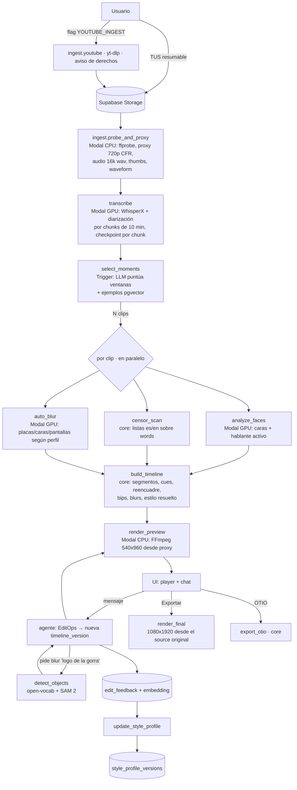

# Plan de arquitectura — Editor de video con IA que aprende estilo

> Estado: **propuesta para aprobación**. No hay código todavía.
> Principio central: la IA nunca toca píxeles. El LLM produce/modifica un
> `Timeline` (JSON validado); un motor determinista lo convierte en video.

---

## 0. Decisiones clave (resumen)

| Tema | Decisión | Por qué |
|---|---|---|
| Monorepo | pnpm workspaces + Turborepo; Python con `uv` | Cache de builds, un solo `pnpm test` |
| Cola | **Trigger.dev** (cloud, v4) | Ver §6. Sin Redis que operar, tareas largas sin timeout, reintentos, idempotency keys, waitpoints para esperar a Modal sin pagar cómputo |
| Workers pesados | Modal (Python): GPU para ASR/detección/tracking, CPU para FFmpeg | Escala a cero, los bytes grandes se quedan cerca del cómputo |
| Render | **FFmpeg + subtítulos ASS (libass)** como motor único. Remotion **opcional** y detrás de una interfaz | Ver §9 (licencia y razones técnicas) |
| Preview en navegador | `<video>` del proxy + **JASSUB** (libass en WASM, MIT) renderizando **el mismo archivo ASS** | Los subtítulos del preview son idénticos al render final; feedback instantáneo sin esperar al re-render |
| Compilador | `Timeline → RenderPlan` en **TypeScript** (`packages/core`). Python solo *ejecuta* el RenderPlan | La lógica vive en un solo lenguaje; el worker Python es un ejecutor tonto y testeable |
| Esquemas | Zod es la fuente de verdad → JSON Schema generado (`z.toJSONSchema`) → modelos Pydantic generados (`datamodel-code-generator`). CI falla si hay drift | Un solo origen, TS y Python validan lo mismo |
| Patches | El agente emite **`EditOp` tipadas** (no JSON Patch crudo); se guardan también como RFC 6902 para auditoría | Los índices de arrays en JSON Patch son frágiles para un LLM; las ops por `id` no |
| Versionado | `timeline_versions` y `style_profile_versions` inmutables | Undo/redo y trazabilidad gratis |
| Tiempo | Enteros en **milisegundos**; coordenadas normalizadas `[0,1]` | Sin errores de coma flotante ni dependencia de resolución |
| LLM | `packages/llm` con adaptadores OpenAI/Anthropic, `LLM_PROVIDER` + `LLM_MODEL` por env. Default Anthropic: `claude-sonnet-5` (agente), `claude-haiku-4-5` (puntuar segmentos en lote) | |
| Herramientas | Un **registro único de tools** (`packages/tools`) usado por el agente interno y por el servidor MCP | Misma API para ambos |

---

## 1. Estructura del monorepo

```
editor/
├─ apps/
│  ├─ web/                 Next.js (App Router) + Tailwind. UI, route handlers, chat del agente (streaming)
│  └─ mcp/                 Servidor MCP (TS): stdio + Streamable HTTP, auth por token de usuario
├─ packages/
│  ├─ schemas/             Zod: Timeline, StyleProfile, EditFeedback, Transcript, Detection, EditOp, RenderPlan
│  │  └─ json/             JSON Schema generado (commiteado, lo consume Python)
│  ├─ core/                Lógica pura y determinista:
│  │                         applyOps(timeline, ops) · mapeo source↔output · compilador Timeline→RenderPlan
│  │                         generador ASS · censura (listas es/en, normalización) · export OTIO
│  ├─ llm/                 Interfaz LLMProvider + adaptadores openai/anthropic + embeddings
│  ├─ agent/               Loop del agente, prompts, selección de momentos, actualizador de perfil
│  ├─ tools/               Registro de herramientas (zod input + handler). Lo consumen agent y apps/mcp
│  ├─ db/                  Cliente Supabase, tipos generados, repositorios
│  └─ jobs/                Tareas Trigger.dev (orquestación; llaman a Modal)
├─ workers/
│  └─ media/               Python (uv) desplegado en Modal
│     ├─ media/schemas/    Pydantic generado desde packages/schemas/json
│     ├─ ingest.py         ffprobe, proxy 720p CFR, audio 16 kHz, miniaturas, waveform
│     ├─ transcribe.py     Interfaz Transcriber → WhisperX (default) | Deepgram | AssemblyAI
│     ├─ detect.py         Interfaz Detector → caras, placas, open-vocabulary (texto libre)
│     ├─ track.py          SAM 2: máscaras/cajas propagadas en el tiempo
│     ├─ speaker.py        Hablante activo (diarización × caras) → track de reencuadre
│     └─ render.py         Ejecuta RenderPlan con FFmpeg (preview / final)
├─ supabase/
│  ├─ migrations/          SQL + RLS
│  └─ seed.sql
├─ fixtures/
│  ├─ video/sample_10s.mp4 Video corto de prueba (<1 MB, generado con script reproducible)
│  └─ transcripts/sample_10s.json
├─ scripts/                gen-schemas, gen-fixture, check-drift
├─ .env.example
└─ docs/
```

---

## 2. Esquemas

Convenciones: `*Ms` = entero en ms. `source*` = tiempo del video original;
`output*` = tiempo del clip resultante. Coordenadas normalizadas al frame del source.

**Regla importante:** todo lo que está *ligado al contenido* (palabras, bips,
blur, reencuadre) se ancla en **tiempo de source**. Así, si el usuario recorta
o reordena segmentos, los subtítulos, bips y blurs siguen en su sitio sin
recalcular nada; el compilador los proyecta a tiempo de salida. Solo lo
*editorial* (música, zooms, títulos) vive en tiempo de salida.

### 2.1 Transcript (entrada para todo lo demás)

```ts
Word       = { id: string, text: string, startMs: int, endMs: int, speaker: string | null, confidence: number }
Transcript = { assetId, language: 'es'|'en'|string, provider: 'whisperx'|'deepgram'|'assemblyai',
               providerVersion, words: Word[], speakers: { id, label }[],
               sentences: { id, startMs, endMs, wordIds: string[], speaker }[] }
```

### 2.2 `StyleProfile` (versionado)

```ts
StyleProfile        = { id, userId, name, activeVersionId, createdAt }
StyleProfileVersion = {
  id, profileId, version: int, parentVersionId: string | null,
  settings: StyleSettings,
  learnedRules: LearnedRule[],                  // preferencias no numéricas en lenguaje natural
  provenance: Record<JsonPointer, {             // por qué cada campo tiene su valor
    source: 'default'|'explicit'|'inferred', confidence: number, evidence: FeedbackId[] }>,
  changeSummary: string, createdBy: 'user'|'agent'|'system', createdAt
}

StyleSettings = {
  captions: {
    fontFamily: string, fontWeight: 400..900, fontSizePx: int,   // referido a 1080 px de ancho
    textColor: Hex, highlightColor: Hex, strokeColor: Hex, strokeWidthPx: number,
    shadow: { color: Hex, blurPx: number, offsetPx: number } | null,
    background: { color: Hex, opacity: 0..1, paddingPx, radiusPx } | null,
    position: { anchor: 'top'|'middle'|'bottom', offsetYPct: number },
    maxWordsPerLine: int, maxLines: 1|2|3, uppercase: boolean,
    animation: 'none'|'word_by_word'|'karaoke_highlight'|'pop'|'bounce'|'typewriter',
    emphasis: { enabled: boolean, color: Hex, scale: number },  // palabras clave marcadas por el LLM
  },
  pacing: {
    clipDurationSec: { min, ideal, max },
    maxShotLengthSec: number,          // fuerza cambio de encuadre/zoom
    removeSilencesAboveMs: int | null,
    removeFillers: boolean,            // "eh", "este", "um", "like"...
  },
  zooms:       { perMinute: number, scale: number, style: 'punch'|'smooth' },
  transitions: { type: 'cut'|'crossfade'|'zoom_punch'|'whip', durationMs: int },
  music:       { enabled: boolean, moods: string[], gainDb: number, duckUnderSpeechDb: number },
  hook:        { type: 'question'|'bold_claim'|'cold_open'|'text_overlay'|'none',
                 maxHookSec: number, textOverlay: boolean },
  reframe:     { defaultMode: 'track'|'fixed'|'split'|'fit_blur_bg',
                 smoothing: 0..1, splitWhenTwoSpeakers: boolean },
  censorship: {
    enabled: boolean, languages: ('es'|'en')[],
    audio: 'bleep'|'mute', bleepHz: int, paddingMs: int,     // margen por imprecisión del alineado
    captionMask: 'asterisks'|'first_letter'|'grawlix'|'none',
    addWords: Record<Lang, string[]>, allowWords: Record<Lang, string[]>,
    autoBlur: { faces: boolean, plates: boolean, screens: boolean, logos: boolean },
    blurEffect: { type: 'gaussian'|'pixelate'|'solid', strength: number },
  },
}

LearnedRule = { id, text: string,              // "prefiere hooks que arrancan con una pregunta"
                appliesTo: 'clip_selection'|'captions'|'pacing'|'audio'|'blur'|'general',
                confidence: number, evidence: FeedbackId[], active: boolean }
```

Cada cambio → nueva fila en `style_profile_versions` y se mueve `activeVersionId`.
El Timeline guarda una **copia resuelta** del estilo + `styleProfileVersionId`,
así un render siempre es reproducible aunque el perfil cambie después.

### 2.3 `Timeline`

```ts
Timeline = {
  schemaVersion: '1',
  id, projectId, clipId, version: int,
  source: { assetId, proxyAssetId, durationMs, width, height, fps: { num, den } },
  output: { width: 1080, height: 1920, fps: 30, maxDurationMs?: int },
  style: { styleProfileVersionId, resolved: StyleSettings },
  meta:  { title, hookText?, justification?, scores?: ClipScores, createdBy: 'llm'|'user' },

  segments: Segment[],             // el orden del array = orden de salida
  reframe:  ReframeTrack[],
  captions: { enabled: boolean, cues: CaptionCue[] },
  blurs:    BlurRegion[],
  audio:    { masterGainDb: number, events: AudioEvent[], music: MusicCue[] },
  overlays: Overlay[],             // tiempo de salida
}

Segment = { id, sourceStartMs, sourceEndMs, speed: 1,
            transitionIn?: { type: 'cut'|'crossfade'|'zoom_punch'|'whip', durationMs } }

ReframeTrack = {
  id, sourceStartMs, sourceEndMs,
  mode: 'track'|'fixed'|'split'|'fit_blur_bg',
  speakerId?: string,
  keyframes: { tMs /*source*/, cx: 0..1, cy: 0..1, zoom: number /*1 = alto completo*/ }[],
  interpolation: 'hold'|'linear'|'smooth',
}

CaptionCue = {
  id, sourceStartMs, sourceEndMs,
  words: { wordId, text, displayText?: string,   // displayText = texto enmascarado "p***"
           sourceStartMs, sourceEndMs, emphasis: boolean, censored: boolean }[],
  styleOverride?: Partial<StyleSettings['captions']>,
}

BlurRegion = {
  id, label: string,                            // "logo de la gorra"
  kind: 'face'|'plate'|'logo'|'screen'|'custom',
  sourceStartMs, sourceEndMs,
  shape: 'rect'|'ellipse'|'mask',
  keyframes: { tMs, x, y, w, h }[],             // normalizadas; siempre presentes (bbox del mask)
  mask?: { assetId, format: 'coco_rle_jsonl', fps: number },   // máscaras SAM 2 por frame
  effect: { type: 'gaussian'|'pixelate'|'solid', strength: number }, featherPx: number,
  detectionTrackId?: string,                    // de dónde salió
}

AudioEvent = { id, type: 'bleep'|'mute'|'duck', sourceStartMs, sourceEndMs,
               reason: 'censorship'|'user', wordId?: string, gainDb?: number, bleepHz?: int }

MusicCue = { id, assetId, outputStartMs, outputEndMs, offsetMs, gainDb,
             duckUnderSpeechDb, fadeInMs, fadeOutMs }

Overlay =
  | { id, type: 'zoom', outputStartMs, outputEndMs, scale, easing: 'linear'|'ease_in_out'|'punch' }
  | { id, type: 'text', outputStartMs, outputEndMs, text, style: 'hook'|'title', position }
```

**Invariantes** (Zod `superRefine`, no expresables en JSON Schema — viven en `packages/core` y se testean):
ids únicos; `start < end`; segmentos dentro de `source.durationMs`; keyframes
ordenados y dentro de `[0,1]`; palabras de un cue dentro del cue; cada
`AudioEvent` de censura con su `wordId` existente; tracks de reencuadre cubren
todos los segmentos; duración de salida ≤ `maxDurationMs`.

### 2.4 `EditOp` (lo que emite el agente)

```ts
EditOp =
  | { op: 'trim_segment', segmentId, sourceStartMs?, sourceEndMs? }
  | { op: 'split_segment', segmentId, atSourceMs }
  | { op: 'delete_segment', segmentId } | { op: 'insert_segment', after?: id, segment }
  | { op: 'reorder_segments', order: id[] }
  | { op: 'edit_caption_word', wordId, displayText?, emphasis? }
  | { op: 'set_caption_style', patch: Partial<Captions>, cueIds?: id[] }
  | { op: 'censor_word', wordId, audio?: 'bleep'|'mute' } | { op: 'uncensor_word', wordId }
  | { op: 'add_blur', region } | { op: 'update_blur', id, patch } | { op: 'remove_blur', id }
  | { op: 'set_reframe', trackId, patch }
  | { op: 'add_overlay', overlay } | { op: 'remove_overlay', id }
  | { op: 'set_music', cue | null }
```

`applyOps(timeline, ops) → { timeline, jsonPatch }` es puro; si el resultado
no valida, la operación completa se rechaza con errores legibles que se
devuelven al LLM para que corrija.

### 2.5 `EditFeedback`

```ts
EditFeedback = {
  id, userId, projectId, clipId, threadId?, messageId?,
  kind: 'approve'|'reject'|'correction'|'instruction',
  area: 'clip_selection'|'captions'|'reframe'|'censorship'|'blur'|'pacing'|'audio'|'other',
  userText?: string,                                // "los subtítulos más grandes, siempre"
  scope: 'this_clip'|'project'|'always',           // clasificado por el LLM ("siempre" vs "aquí")
  timelineVersionBefore, timelineVersionAfter?,
  ops: EditOp[], jsonPatch: Rfc6902Op[],
  profileVersionBefore, profileVersionAfter?,       // si provocó cambio de perfil
  context: { summary: string,                        // lo que se embebe
             transcriptExcerpt: string, clipFeatures: Record<string, number|string> },
  embedding: vector, embeddingModel: string, createdAt
}
```

**Cómo aprende el perfil** (fase 4):
1. `scope = 'always'` + instrucción explícita → cambio inmediato en `settings` (`provenance.source = 'explicit'`).
2. Señales implícitas (rechazos, correcciones repetidas) → se acumulan; el
   *profile updater* (LLM con salida estructurada) propone cambios solo cuando
   hay ≥ N evidencias consistentes; valores numéricos con media móvil
   exponencial (p. ej. duración ideal de clip a partir de clips aprobados).
3. Preferencias no numéricas → `learnedRules` con confianza y evidencias.
4. Antes de proponer, el agente recupera top-k `EditFeedback` similares
   (pgvector, filtrado por usuario) y los usa como ejemplos few-shot.
5. El usuario ve y puede revertir cualquier versión del perfil.

---

## 3. Tablas de Supabase

Todas con `user_id` y **RLS** (`user_id = auth.uid()`). Timestamps `created_at/updated_at`.

| Tabla | Columnas clave |
|---|---|
| `projects` | id, user_id, name, mode (`clips`\|`reels`), style_profile_id, status |
| `media_assets` | id, project_id, kind (`source`\|`proxy`\|`audio`\|`thumb`\|`waveform`\|`music`\|`mask`\|`render`), storage_path, sha256, duration_ms, width, height, fps_num, fps_den, codec, bytes, probe jsonb |
| `transcripts` | id, asset_id, provider, provider_version, language, storage_path (JSON completo), text tsvector, status |
| `transcript_sentences` | id, transcript_id, start_ms, end_ms, speaker, text — para búsqueda y selección de momentos |
| `detection_tracks` | id, asset_id, job_id, query (texto libre), kind, model, start_ms, end_ms, keyframes jsonb, mask_asset_id, score |
| `clips` | id, project_id, status (`proposed`\|`approved`\|`rejected`\|`final`), rank, scores jsonb, justification, current_timeline_version |
| `timeline_versions` | id, clip_id, version, parent_version, timeline jsonb, ops jsonb, json_patch jsonb, author (`user`\|`agent`\|`system`), UNIQUE(clip_id, version) |
| `renders` | id, clip_id, timeline_version, quality (`preview`\|`final`), plan_hash, asset_id, status |
| `jobs` | id, user_id, project_id, type, status (`queued`\|`running`\|`waiting`\|`succeeded`\|`failed`\|`canceled`), progress 0..1, step, idempotency_key UNIQUE, input jsonb, output jsonb, error, attempts, trigger_run_id, modal_call_id, parent_job_id |
| `style_profiles` | id, user_id, name, active_version_id |
| `style_profile_versions` | id, profile_id, version, parent_version_id, settings jsonb, learned_rules jsonb, provenance jsonb, change_summary, created_by |
| `edit_feedback` | ver §2.5; `embedding vector(1536)`, `embedding_model`; índice HNSW `vector_cosine_ops` |
| `chat_threads` / `chat_messages` | thread por clip; mensajes con role, content, tool_calls jsonb, timeline_version resultante |
| `censorship_lists` | user overrides (lang, word, action add/allow). Las listas base viven en el repo (`packages/core/censorship/{es,en}.json`) |
| `mcp_tokens` | id, user_id, hash, scopes, last_used_at |

Storage: buckets privados `sources/`, `derived/` (proxy, audio, máscaras), `renders/`. Rutas deterministas `{user}/{project}/{asset}/…` para que los reintentos sobrescriban en vez de duplicar.

Realtime: la UI se suscribe a `jobs`, `clips` y `renders` por `project_id`.

---

## 4. Flujo de jobs



**Garantías de cada job**
- **Asíncrono**: la API solo encola y devuelve `job_id`; la UI lee `jobs` por Realtime.
- **Idempotente**: `idempotency_key = sha256(type ‖ input asset sha256 ‖ params canónicos ‖ worker_version)`. Si ya existe `succeeded`, se devuelve su `output` sin recomputar (se pasa también como idempotency key de Trigger.dev).
- **Reanudable**: pasos pequeños con salidas en rutas deterministas; la transcripción larga se trocea y cada chunk se guarda — un reintento salta los chunks ya hechos. Trigger.dev reintenta con backoff; Modal se invoca con `spawn()` y el task espera en un *waitpoint* que completa el webhook de Modal (no paga cómputo mientras espera).
- **Cancelable**: `jobs.status = canceled` → Trigger cancela el run y Modal la llamada.

---

## 5. Pipeline por paso (detalles técnicos que afectan al diseño)

1. **Ingesta**: subida TUS directa a Supabase Storage desde el navegador (reanuda tras cortes). ⚠️ El plan Free de Supabase limita el tamaño de archivo a 50 MB; para varios GB hace falta plan Pro (subir el límite del bucket). Alternativa si prefieres: Cloudflare R2 multipart. Se normaliza a proxy **CFR** (los VFR de móvil rompen la sincronía de cortes y subtítulos).
2. **Transcripción**: WhisperX (BSD-2) con alineado wav2vec2 por palabra + pyannote (modelos con acceso gated en Hugging Face → `HF_TOKEN`). Interfaz `Transcriber` para Deepgram/AssemblyAI. Se desactiva el filtrado de groserías del proveedor (Deepgram tiene `profanity_filter`) para poder censurar nosotros con precisión.
3. **Selección de momentos**: ventanas candidatas cortadas en límites de oración con duraciones del perfil → LLM (salida estructurada) puntúa `hook`, `payoff` (cierre completo), `standalone`, `emotion`, `durationFit` + justificación y título → top-N sin solapamiento.
4. **Reencuadre 9:16**: detección de caras a ~5 fps + tracking; hablante activo = diarización × actividad de boca (heurística de energía de movimiento labial vs. energía de audio en v1; modelo LR-ASD después). Ruta de cámara suavizada (hold + pan suave, corte duro al cambiar hablante). Salida: keyframes en el Timeline.
5. **Subtítulos**: agrupado de palabras en cues según `maxWordsPerLine`/`maxLines` y pausas; ASS con `\k`/`\t` para karaoke/pop. Fuentes empaquetadas (Google Fonts OFL) en el worker y en el navegador.
6. **Censura**: listas por idioma con normalización (acentos, alargamientos "puuuta", leetspeak, formas flexionadas vía raíces/regex). Bip (seno a `bleepHz`) o silencio en `[start - padding, end + padding]`; en subtítulos `displayText` enmascarado.
7. **Blur**: ⚠️ YOLO "normal" solo detecta clases fijas (COCO): no sabe qué es "el logo de la gorra". Para lenguaje natural hace falta un detector **open-vocabulary** (Grounding DINO / OWLv2) → caja inicial → **SAM 2** propaga la máscara en el tiempo. Placas: detector específico fine-tuneado. El agente traduce la frase a `detect_objects({query, timeRange})`, muestra las detecciones y crea `BlurRegion`.
8. **Render**: preview 540×960 desde el proxy (rápido); final 1080×1920 desde el original. El `RenderPlan` tiene hash → mismo plan, mismo archivo (cache).

---

## 6. Trigger.dev vs BullMQ

Recomiendo **Trigger.dev**:
- Tareas de minutos/horas sin timeouts y sin mantener workers Node ni Redis.
- Reintentos, idempotency keys, colas con concurrencia por usuario y *waitpoints* nativos (esperar el webhook de Modal).
- Dashboard de runs para depurar; Realtime API si algún día queremos progreso fino.
- Coste: servicio de pago por uso; se puede self-hostear si hace falta.

BullMQ tendría sentido si quisieras todo self-hosted y ya operaras Redis. En ambos casos la tabla `jobs` es la fuente de verdad para la UI, así que cambiar de cola más adelante no toca el frontend.

---

## 7. Capa LLM y agente

- `LLMProvider.generate({ system, messages, tools, responseSchema, stream })` y `embed(texts)`.
- Adaptadores: `anthropic` y `openai`; selección por `LLM_PROVIDER`, `LLM_MODEL`, `LLM_FAST_MODEL`.
- **Embeddings**: Anthropic no ofrece API de embeddings → `EMBEDDINGS_PROVIDER` separado (OpenAI `text-embedding-3-small`, 1536 dims, o Voyage). La dimensión de la columna depende del modelo elegido; se guarda `embedding_model` para poder re-embeber.
- Agente: herramientas del registro compartido; cada turno produce `EditOp[]` → `applyOps` → validación → nueva versión → `render_preview` → respuesta. Contexto: transcript del clip, timeline actual (compacto), perfil activo, top-k feedback similar.

---

## 8. Herramientas MCP

Definidas una vez en `packages/tools` (input Zod → JSON Schema para MCP):
`list_projects`, `get_transcript`, `propose_clips`, `get_timeline`,
`patch_timeline` (acepta `EditOp[]`, y opcionalmente RFC 6902 validado),
`add_blur_region`, `detect_objects`, `set_censorship`, `get_style_profile`,
`update_style_profile`, `render_preview`, `render_final`, `export_otio`.
Las herramientas que lanzan jobs devuelven `{ jobId }` + una tool `get_job` para consultar estado.
Auth del servidor MCP remoto: token personal (`mcp_tokens`) → se ejecuta con los permisos RLS del usuario.

**OTIO**: export `.otio` con los cortes sobre el media original (y marcadores para bips/blur). OTIO no representa el blur ni el ASS; exportaremos además el `.ass`/`.srt` y, opcionalmente, un render del track de blur como capa aparte. Se generará en TS directamente (el formato es JSON) para no depender de Python en ese camino.

---

## 9. ⚠️ Licencia de Remotion (y otras que te afectan)

**Remotion** (LICENSE.md actual del repo, verificado hoy): gratis para individuos,
empresas con **hasta 3 empleados**, ONG y evaluación. A partir de 4 empleados en
una empresa con ánimo de lucro se requiere **Company License** (de pago,
remotion.pro). No pude acceder a remotion.pro para confirmar el precio actual ni
cómo tarifican el render automatizado en un SaaS (históricamente cobraban por
render en ese caso) — revísalo antes de depender de ello.

**Mi recomendación: no usar Remotion en el camino principal.** Además de la licencia:
- Renderiza con Chrome headless frame a frame: mucho más lento y caro que FFmpeg para clips de 30–90 s.
- Obligaría a dos pasadas (Remotion para subtítulos + FFmpeg para blur/audio) o a meter todo en Remotion.
- Lo que necesitamos (subtítulos palabra por palabra, highlight, pop, bounce, emphasis, cajas de fondo) lo cubre **ASS/libass** dentro de FFmpeg en una sola pasada, y con **JASSUB** el navegador pinta exactamente el mismo ASS en el preview.

Dejo `Renderer` como interfaz; si más adelante queréis gráficos animados complejos (emojis animados, lower thirds con motion design), se añade un `RemotionOverlayRenderer` que produce una capa con alfa y FFmpeg la compone.

**Otras licencias a vigilar**
- **Ultralytics YOLO (v8/11): AGPL-3.0** (verificado). Usarlo en un SaaS obliga a publicar el código del servicio o comprar su licencia Enterprise. Alternativas Apache-2.0: RT-DETR (Hugging Face), YOLOX, Grounding DINO / OWLv2 (open-vocab). Propongo **no usar Ultralytics** salvo que compréis la licencia.
- **SAM 2**: Apache-2.0 ✅. **JASSUB**: MIT ✅. **WhisperX**: BSD-2 ✅. **pyannote**: MIT, modelos gated (aceptar términos en HF).
- **FFmpeg**: usar build LGPL o GPL sin `--enable-nonfree`; como corre en nuestro servidor y no se distribuye, GPL no nos obliga a nada extra.
- **YouTube**: `yt-dlp` puede violar los ToS de YouTube; queda detrás de `FEATURE_YOUTUBE_INGEST=false` con aviso de derechos.

---

## 10. Tests

- `packages/schemas` / `packages/core` (Vitest): casos válidos/invalidos del Timeline (cada invariante), `applyOps` (property tests con fast-check: aplicar ops nunca produce un Timeline inválido sin error), mapeo source↔output, generador ASS (snapshots), censura es/en.
- `workers/media` (pytest): validación Pydantic contra los mismos fixtures JSON (garantiza paridad TS/Python).
- **Render** (integración, CI con FFmpeg): `fixtures/video/sample_10s.mp4` (generado por script: patrón + tono + cara sintética) → RenderPlan → MP4; se comprueba con ffprobe duración, resolución 1080×1920, silencio/bip en el rango censurado (`astats`), varianza de píxeles baja dentro de la región de blur, y hash estable del plan.
- E2E ligero de la API (Playwright) a partir de la fase 1.

---

## 11. Fases

| Fase | Entrega de punta a punta |
|---|---|
| **1** | Monorepo, esquemas + generación JSON Schema/Pydantic, migraciones, auth. Subida TUS → ingest (proxy) → WhisperX → el usuario elige un rango en la transcripción → Timeline con estilo por defecto → render preview → player con JASSUB. Tests de validador y de render. |
| **2** | `select_moments` con LLM (N clips + justificación), reencuadre 9:16 con hablante activo, lista de clips en la UI, render final. |
| **3** | Censura es/en (bip/mute + máscara en subtítulos), auto-blur (caras/placas/pantallas), `detect_objects` open-vocab + SAM 2, edición manual de regiones en el player. |
| **4** | Chat con agente, `EditOp` + versiones + undo, `EditFeedback` con embeddings, actualizador de perfil y UI de perfil/versiones. |
| **5** | Servidor MCP (stdio + HTTP con tokens), export OTIO + ASS/SRT. |

Al terminar cada fase: resumen de qué quedó, cómo probarlo y qué falta.

---

## 12. Preguntas antes de empezar

1. **Supabase**: ¿plan Pro (subidas de varios GB)? ¿O prefieres R2 para los archivos grandes?
2. **Render**: ¿apruebas FFmpeg + ASS + JASSUB y dejar Remotion como opcional?
3. **Detección**: ¿ok con evitar Ultralytics (AGPL) y usar RT-DETR/Grounding DINO + SAM 2?
4. **Embeddings**: ¿OpenAI `text-embedding-3-small` o Voyage?
5. **Trigger.dev cloud** (recomendado) o self-host / BullMQ.
6. Idioma de la UI: ¿español, inglés o ambos (i18n desde el inicio)?
